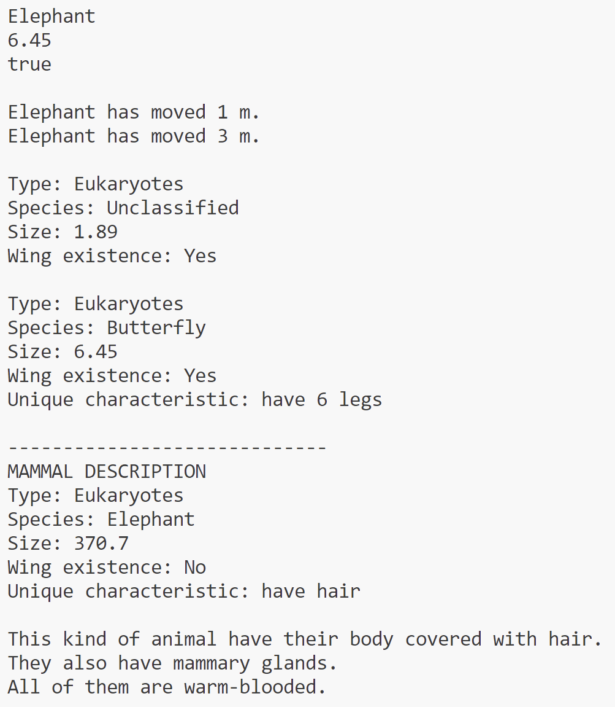
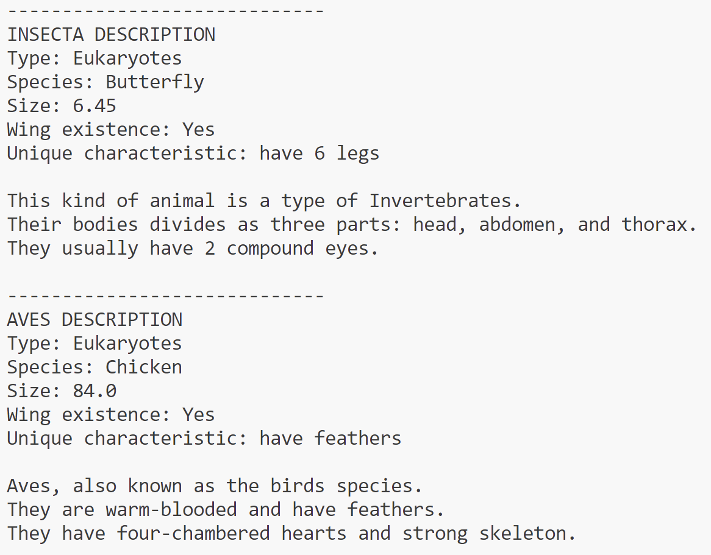

# Exercise1-DataStructureTA

**Name:** Ellis Raputri

**Class:** L2AC

**ID Number:** 2702298116

 

## Brief Description
This repository cointains the answer for the part two exercises for Data Structure TA. It is an exercise of OOP implementation in Java. This repository has a driver class (Main.java), a base class (Animal.java), and three child classes (Mammal.java, Insecta.java, and Aves.java).

 

## Files
- Main.java - the driver class
- Animal.java - base class
- Mammal.java - child class (extends from class Animal)
- Insecta.java - child class (extends from class Animal)
- Aves.java - child class (extends from class Animal)

 

## Code Explanation

&ensp;<b>Encapsulation</b>

- The animal class some private attributes, like species, size, and existence of wing. It also has the getter and setter functions for the attributes. So, if the user wants to do something with the attributes, the user has to use the getter and the setter. And, this is the encapsulation part of this code. It prevents user to change or access the attributes directly.

 

&ensp;<b>Inheritance</b>

- The inheritance principle can be seen from the children classes that inherits from the Animal class, i.e. Mammal, Insecta, and Aves. These classes inherit some general attributes and methods from the Animal class. So, the attributes and methods inherited can be used directly in the child class (without re-declaring them).

 

&ensp;<b>Polymorphism</b>

- There are two types of polymorphism in this code. The first one is function overloading, which can be seen in the move() method in the Animal class. There are two move() method in the class, but it will be executed individually based on the parameter given. Second, we have the function overriding. In every children class, the shortDescription() method will override the shortDescription() method in the base class.

 

 

## Output Screenshots

Here are the outputs from running Main.java file:

 

